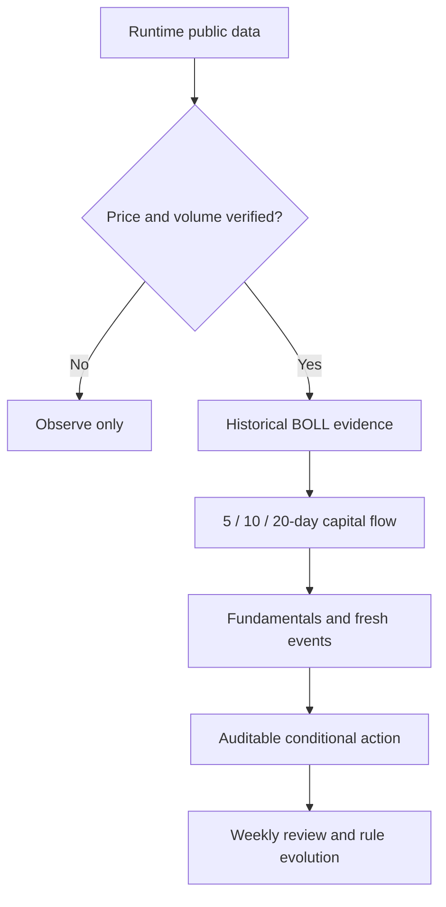

<div align="center">

# A-Share Antifragile Trading Loop

### A privacy-first weekly research loop for China A-shares

Verify the numbers. Delete stale stories. Let auditable evidence lead the next action.

[English](README.md) | [Español](docs/README.es.md) | [简体中文](docs/README.zh-CN.md)

[](LICENSE)
[](https://www.python.org/)
[](#what-it-does)
[](#privacy-by-design)
[](#verification)


</div>

> [!IMPORTANT]
> Education and research only. The project does not place orders and does not promise investment performance.

## Why this exists

A weekly review becomes fragile when fresh prices, stale events, inconsistent time windows, and personal conviction are mixed together. This project turns the review into a small, testable loop:

1. Fetch public runtime data.
2. Make every time window explicit.
3. Stop when price or volume cannot be verified.
4. Give adequately sampled historical BOLL evidence the highest decision weight.
5. Use capital flow, fundamentals, commodities, and events as confirmation or constraints.
6. Show degraded inputs instead of inventing replacements.

## What it does

| Capability | Public behavior |
|---|---|
| A-share market context | SSE Composite, SZSE Component, and STAR 50 snapshots |
| Optional watchlist | Accepts symbols only through `WATCH_TICKERS`; the default is empty |
| Weekly window | Calculates first open to last close of the latest represented trading week |
| Capital-flow windows | Aggregates exact 5/10/20-trading-day windows and retains start/end dates |
| Decision arbitration | Hard data gate, then BOLL > price/volume > flow > fundamentals > macro narrative |
| Event freshness | Rejects event claims older than 168 hours from the review time |
| Gold positioning | Reads public weekly CFTC COMEX managed-money positioning with explicit fallback |
| Failure behavior | Marks unavailable data; never substitutes simulated market values |

## Privacy by design

- No default stock list, portfolio, position size, purchase cost, account, or email.
- Generated reports, local configuration, logs, exports, and charts are ignored by Git.
- Research symbols are supplied at runtime and remain local unless the user publishes them.
- Public modules operate on generic evidence objects, not a hidden personal profile.

## Quick start

```bash
git clone https://github.com/marqosjiang-gif/A-Share-Antifragile-Trading-Loop.git
cd A-Share-Antifragile-Trading-Loop
python3 -m venv .venv
source .venv/bin/activate
python3 run_weekly_report.py
```

The first run needs no stock list and produces market context only. To add your own research symbols:

```bash
export WATCH_TICKERS="<six-digit-symbol>.SS,<six-digit-symbol>.SZ"
python3 run_weekly_report.py
```

Set `ENABLE_CFTC_GOLD=0` to skip the public CFTC request. Shanghai uses `.SS`; Shenzhen uses `.SZ`.

## Output

```text
antifragile_weekly_YYYYMMDD.md
```

The file contains market context, optional weekly symbol moves, public gold-positioning context, source degradation, and research guardrails.

## Decision contract



An actionable BOLL result requires verified data and at least three completed historical trades. Lower-priority signals may constrain confidence, but they cannot silently overwrite a valid higher-priority signal.

## Project structure

```text
.
├── antifragile/
│   ├── cftc.py          # public COMEX gold positioning
│   ├── decision.py      # evidence priority and action arbitration
│   ├── flows.py         # exact 5/10/20-day flow windows
│   └── freshness.py     # 168-hour event gate
├── assets/readme/
├── docs/
├── run_weekly_report.py
├── test_public_snapshot.py
├── config.yaml
└── DESIGN.md
```

## Verification

```bash
python3 -m py_compile run_weekly_report.py antifragile/*.py
python3 -m unittest test_public_snapshot -v
```

The test suite covers symbol privacy defaults, exact flow windows, duplicate-date rejection, event freshness, BOLL priority, low-sample protection, conflicting evidence, and CFTC parsing.

## Configuration

| Variable | Purpose | Default |
|---|---|---|
| `WATCH_TICKERS` | Comma-separated A-share symbols | Empty |
| `ENABLE_CFTC_GOLD` | Enable public CFTC gold context | `1` |

The public core uses only the Python standard library.

## Contributing

Issues and pull requests are welcome. Do not commit credentials, personal financial data, generated reports, private paths, or proprietary material.

## License

Released under the [MIT License](LICENSE).

## Disclaimer

Market data may be delayed, incomplete, revised, or unavailable. Users remain responsible for validating sources and making their own decisions.
