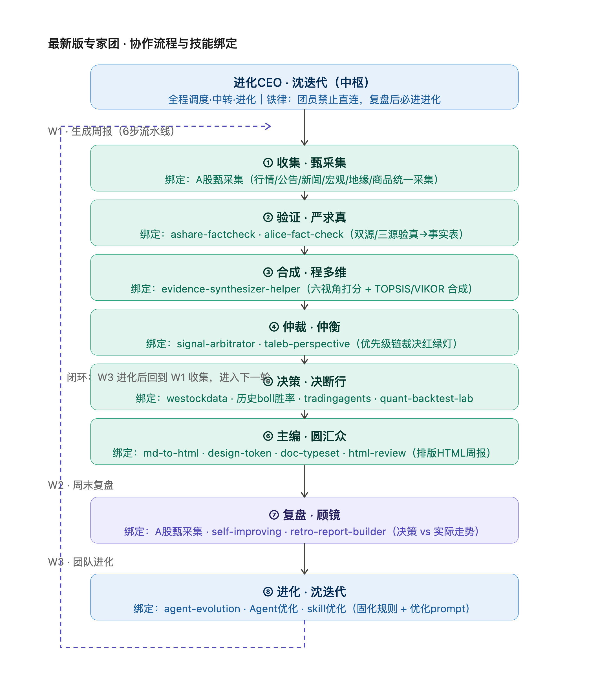
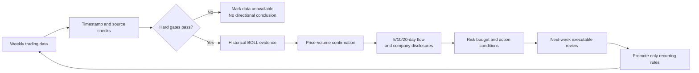

<div align="center">

# A-Share Antifragile Trading Loop

### An evidence-first research loop with an expert council and bounded self-improvement

**Collect. Verify. Debate. Arbitrate. Review. Evolve.**

[English](README.md) | [Español](docs/README.es.md) | [简体中文](docs/README.zh-CN.md)

[](LICENSE)
[](https://www.python.org/)
[](#what-it-is)
[](#how-the-loop-works)
[](#important-boundaries)


**[Why](#why-this-project) · [Quick start](#quick-start) · [Expert council](#the-expert-council) · [Evolution](#bounded-self-improvement) · [Privacy](#privacy-boundary)**

</div>

> [!IMPORTANT]
> This repository is for quantitative research and decision support. It does not connect to a broker, place orders, or provide investment advice.

## Why This Project

Most individual A-share workflows are too fast to audit and too slow to learn from: daily noise is mistaken for a trend, old news is used as a catalyst, and a backtest price is treated as if it were executable.

**A-Share Antifragile Trading Loop** packages a slower, rule-led alternative for weekly review and next-week preparation—not intraday prediction. Its two differentiators are:

1. **Expert council:** collection, verification, synthesis, arbitration, decision and publishing are separate stages with explicit handoff contracts.
2. **Bounded self-improvement:** each report is reviewed against the information available at its cutoff; only recurring, decision-relevant and policy-approved rules are promoted.

Its reusable methods are:

- **Weekly measurement:** calculate returns from the first actual market open to the last actual close of the same trading week.
- **Evidence gates:** verify price, volume, timestamps, source agreement, and missing-data status before interpretation.
- **Signal hierarchy:** historical BOLL evidence has the highest weight only after data-quality and survival-risk gates pass; price-volume confirmation, multi-window capital flow, company disclosures, and macro context follow.
- **Via Negativa:** a narrative without a dated, verifiable source cannot become a trading reason.
- **Time-safe review:** a report may only be judged using information public by its `evidence_cutoff`; later disclosures are new events, not proof that the prior report should have known them.
- **Evolution loop:** retain recurring process rules, while keeping weekly opinions and generated reports local.

The repository contains a public reference runner, a configurable watchlist template, the public research protocol, the expert-council design, the evolution-loop contract, and tests. Your own watchlist, position size, cost basis, account data, API credentials, reports, and local caches stay outside Git.

## The Expert Council



The coordinator routes work through six stages:

- **Collect:** dated observations from market, filings, news, macro and commodities.
- **Verify:** source agreement, timestamps, missing-data and conflict checks.
- **Synthesize:** compare perspectives and make assumptions explicit.
- **Arbitrate:** apply hard survival gates and the signal hierarchy.
- **Decide:** produce conditional next-week checks and risk controls.
- **Publish:** render an auditable Markdown/HTML report.

Read the detailed public contract in [`docs/expert-team.md`](docs/expert-team.md).

## Bounded Self-Improvement

The loop follows **W1 generate → W2 review → W3 evolve → W1**. It classifies gaps, keeps one-off opinions local, and promotes only recurring improvements that pass a human or policy gate. It can improve the research process; it cannot place orders, modify a brokerage account, or silently expose private data.

Read [`docs/evolution-loop.md`](docs/evolution-loop.md) for the promotion rules and review record.

## Install

```bash
git clone https://github.com/marqosjiang-gif/A-Share-Antifragile-Trading-Loop.git
cd A-Share-Antifragile-Trading-Loop

python3 -m venv .venv
source .venv/bin/activate
python3 -m pip install --upgrade pip
python3 -m pip install -r requirements.txt
```

On Windows PowerShell:

```powershell
.venv\Scripts\Activate.ps1
```

## Quick Start

Create a local watchlist from the public template. The local filename is ignored by Git.

```bash
cp watchlist.example.json watchlist.local.json
```

Edit only the codes and display names you want to research. Do not add share counts, cost basis, account information, or credentials.

Generate a weekly research scaffold:

```bash
python3 quant_loop.py --watchlist watchlist.local.json
```

It creates `weekly_quant_research_YYYYMMDD.md`, containing the run time, an evidence cutoff, the intended next-week validation window, and a watchlist checklist. The file is deliberately ignored by Git.

## How The Public Reference Loop Works



The ordering matters. A macro story cannot override valid BOLL evidence, and a BOLL result cannot override a data conflict, a low-sample backtest, or a survival-risk gate.

| Layer | Question | Rule |
|---|---|---|
| Data integrity | Are price, volume, dates, and sources usable? | Unresolved price disagreement blocks a directional conclusion. |
| Historical BOLL | Has this weekly/monthly setup worked with enough completed observations? | It is the highest-weight technical input, not a guarantee. |
| Confirmation | Do price-volume and 5/10/20-day flows agree? | A single-day move cannot erase a medium-term signal. |
| Company evidence | Is there a dated disclosure that changes the thesis? | Later events never backfill the prior report. |
| Macro context | Does a verified factor change the risk budget? | Context can constrain risk, not manufacture a trade. |

## Configuration

| File | Purpose | Public? |
|---|---|---|
| [`watchlist.example.json`](watchlist.example.json) | Schema-only watchlist template | Yes |
| `watchlist.local.json` | Your actual research universe | No, ignored |
| [`config.example.yaml`](config.example.yaml) | Optional local integration placeholders | Yes |
| `config.local.yaml` | Your paths, keys, and local settings | No, ignored |
| [`PUBLIC_PROTOCOL.md`](PUBLIC_PROTOCOL.md) | Data, timing, review, and privacy rules | Yes |

The reference runner uses only the standard library. Optional research modules may use `pandas`, `yfinance`, `matplotlib`, or `akshare` when you choose to build them into a local workflow.

## Usage Example

`watchlist.local.json`:

```json
{
  "universe": [
    {"code": "000001", "exchange": "SZ", "name": "Example A-share"}
  ]
}
```

Run:

```bash
python3 quant_loop.py --watchlist watchlist.local.json --as-of 2026-08-03
```

The output deliberately records these boundaries:

- `report_generated_at`: when the report was produced.
- `evidence_cutoff`: the latest public information allowed into the report.
- `validation_window`: the next actual trading week, from the first executable open to the last close.
- `decision_status`: `research_only` until data and rule gates are completed.

## Privacy Boundary

- No order routing, brokerage integration, or automatic position changes.
- No claim of future return, win rate, or live trading performance.
- No generated report, local cache, position size, cost basis, email address, token, or API key belongs in a public commit.
- A later announcement can trigger a new review, but it cannot be used to call an earlier report wrong unless it was already public before that report's evidence cutoff.
- A backtest or review starts at the next executable market point, not at a convenient historical close.
- No personal stock list, position quantity, cost basis, account identifier, email, API key, token, cached quote, generated report, or local absolute path belongs in a public commit.

## FAQ

### Is this an automatic trading bot?

No. It is a medium-low frequency research workflow. It prepares evidence, constraints, and conditions for a human decision.

### Which strategy has the highest priority?

Historical BOLL evidence, but only after data integrity and survival-risk gates pass. A small sample, a stale series, or unresolved data conflict reduces it to observation-only.

### Why no ready-made stock list or portfolio?

Personal watchlists and positions are private and can bias a public project. Configure your own local universe from the template.

### Why does the generated file avoid a buy/sell command?

The public reference runner proves the timing and audit structure. A real decision requires live, verified data and your own risk constraints.

## Contributing

Issues and pull requests are welcome. Keep rule changes testable and auditable. Do not submit private watchlists, account data, generated research reports, credentials, or unverified market claims.

## License

Released under the [MIT License](LICENSE).
