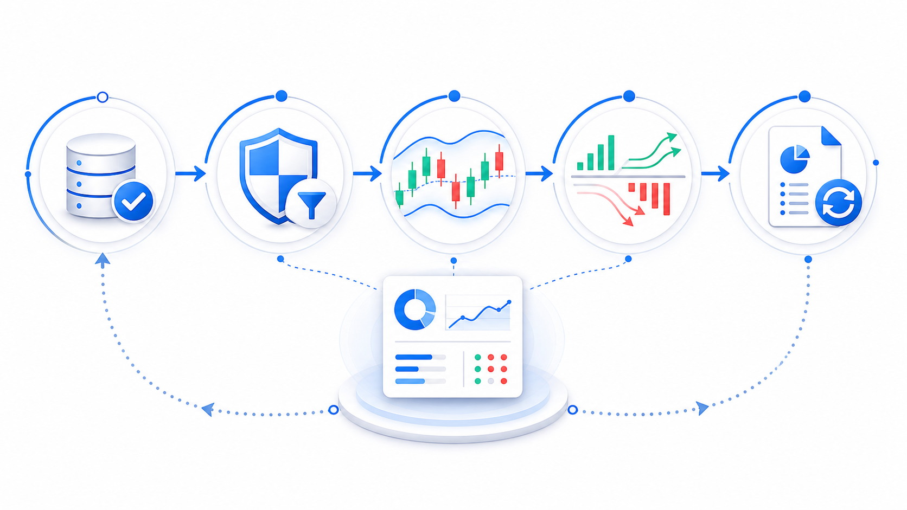

<div align="center">

# A-Share Antifragile Trading Loop

### A weekly evidence loop for disciplined A-share research

Verify the data. Filter the story. Decide with evidence. Learn from the result.

[English](README.md) | [Español](docs/README.es.md) | [简体中文](docs/README.zh-CN.md)

[](LICENSE)
[](https://www.python.org/)
[](#what-this-project-does)
[](#quick-start)
[](#configuration)


**[What it does](#what-this-project-does) · [Install](#installation) · [Quick start](#quick-start) · [Example](#usage-example) · [Configuration](#configuration) · [FAQ](#faq)**

</div>

> [!IMPORTANT]
> This is an A-share research and decision-support project. It never places orders, and it is not financial advice.

## What This Project Does

**A-Share Antifragile Trading Loop** turns a weekly market review into an auditable research routine. It creates a Markdown strategy report from public market data, then makes the quality of the evidence visible instead of hiding missing, stale, or conflicting inputs.

The public workflow contract is defined in [`A股反脆弱策略SKILL.md`](A股反脆弱策略SKILL.md) and [`docs/RESEARCH_PROTOCOL.md`](docs/RESEARCH_PROTOCOL.md). The root runner, [`run_weekly_report.py`](run_weekly_report.py), starts the key-free public snapshot and writes `antifragile_weekly_YYYYMMDD.md` to the project root.

It is designed for investors who want to separate facts from narratives before making a weekly swing-trading decision:

- Verify price, volume, dates, and source agreement before interpretation.
- Prioritize historical BOLL evidence after hard risk and data-quality gates.
- Distinguish 5-day sector-flow confirmation from 5/10/20-day individual-stock flow.
- Surface earnings dates, announcements, event risks, and fresh geopolitical checks.
- Compare DXY and Brent on explicit weekly windows without turning macro context into a stock signal.
- Apply *Via Negativa*: unsupported narratives cannot become trading reasons.
- Record recurring errors in an evolution log so the next report improves without rewriting history.



## Installation

### 1. Clone the repository

```bash
git clone https://github.com/marqosjiang-gif/A-Share-Antifragile-Trading-Loop.git
cd A-Share-Antifragile-Trading-Loop
```

### 2. Create a Python environment

```bash
python3 -m venv .venv
source .venv/bin/activate
```

On Windows PowerShell, activate with:

```powershell
.venv\Scripts\Activate.ps1
```

### 3. Install dependencies

```bash
python3 -m pip install --upgrade pip
python3 -m pip install -r requirements.txt
```

The public core uses only the Python standard library. Keep optional analytics packages in your own extension environment.

## Quick Start

Run the weekly report generator from the repository root:

```bash
python3 run_weekly_report.py
```

The public runner builds a key-free market snapshot, optional watchlist moves, DXY and Brent weekly context, a local forward earnings calendar, and public CFTC gold positioning. Missing sources stay visible instead of being replaced with simulated values.

The result is saved as:

```text
antifragile_weekly_YYYYMMDD.md
```

Before using the output for research, set `WATCH_TICKERS` to your own A-share symbols. Keep any portfolio details only in a local ignored file. Do not commit personal portfolio quantities, costs, reports, email addresses, or credentials.

## Usage Example

### Generate a report

```bash
python3 run_weekly_report.py
```

### Validate the Python entry points after a workflow change

```bash
python3 -m py_compile run_weekly_report.py antifragile/*.py
```

### Run the focused decision-rule tests

```bash
python3 -m unittest test_public_snapshot -v
```

### Read the generated report correctly

| Report area | Question it answers | Guardrail |
|---|---|---|
| Sector strength + 5-day flow | Is a concept sector rising with capital confirmation? | Price-only momentum stays observation-only. |
| H20 capital-flow radar | Is a stock move short-term or persistent across 5/10/20 trading days? | Unverified flow cannot support a directional claim. |
| Historical BOLL | Does the current location match a tested weekly/monthly strategy? | BOLL has the highest decision weight after hard gates pass. |
| Event and earnings monitor | Is there a near-term disclosure or material event? | Incomplete scans are labeled, not silently treated as clear. |
| DXY and Brent | Is weekly macro pressure strengthening or easing? | Context only; it cannot create a stock action by itself. |
| Evolution log | What failed or drifted last week? | Only recurring, decision-relevant rules are promoted. |

## Configuration

[`config.yaml`](config.yaml) documents the public evidence policy and time-window rules. Runtime options are supplied through environment variables; unavailable sources degrade visibly instead of stopping the report.

| Setting | Purpose | Required |
|---|---|---|
| `WATCH_TICKERS` | Comma-separated `.SS` / `.SZ` research symbols | No |
| `ENABLE_CFTC_GOLD` | Enable public CFTC gold positioning | No |
| `ENABLE_MACRO_CONTEXT` | Enable public DXY and Brent weekly context | No |
| `EARNINGS_CALENDAR_PATH` | Path to an ignored local earnings calendar | No |

The weekly report uses explicit time windows:

- Weekly price movement: first actual A-share market open to Friday close.
- Sector capital confirmation: cumulative five trading days.
- Individual-stock H20 radar: 5, 10, and 20 trading days, each labeled separately.
- Event monitoring: recent and forward-looking windows are printed in the report.
- DXY: latest two Friday closes, with a two-trading-day fallback labeled explicitly.
- Brent: latest five valid FRED observations, with degraded sample size labeled explicitly.

### Optional earnings calendar

Copy `earnings_calendar.example.json` to the ignored local file `earnings_calendar.json`, then add only the symbols you want to monitor. The reusable helper in `antifragile/earnings_calendar.py` renders the next 7-day and 30-day disclosure windows, and reports missing dates as missing rather than inventing them.

## FAQ

### Does it trade automatically or send orders to a broker?

No. It only generates research output and risk-aware action suggestions.

### Do I need an API key?

No for the basic report path. Optional integrations may need local tools, environment variables, or credentials. Leave unavailable integrations blank; the report should state any resulting degradation.

### Why does the report show a warning instead of a conclusion?

That is deliberate. A missing source, stale event, price disagreement, incomplete scan, or unverified capital-flow reading must not be converted into a confident trading narrative.

### How should I change the watchlist?

Set `WATCH_TICKERS` in your shell or local environment. Use only your own local configuration and keep personal position information outside Git.

### What should be committed to a public fork?

Source code, generic configuration templates, tests, documentation, and non-sensitive visual assets. Do not commit generated reports, local caches, portfolio quantities or costs, personal email addresses, API keys, tokens, or local absolute paths.

## License

Released under the [MIT License](LICENSE).

## Disclaimer

This repository is for education and quantitative research only. Market data can be delayed, incomplete, or unavailable. No signal, backtest, or report guarantees future performance. You are responsible for your own investment decisions.
