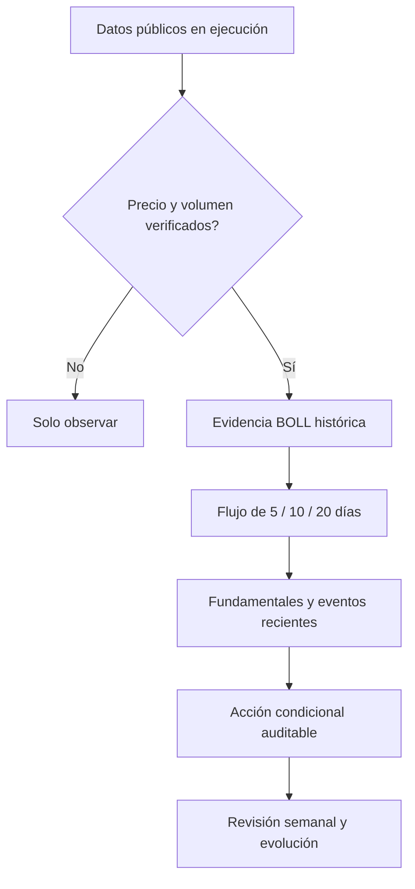

<div align="center">

# A-Share Antifragile Trading Loop

### Un ciclo semanal, privado y verificable para investigar acciones A de China

Verifica los datos. Elimina relatos caducados. Decide con evidencia auditable.

[English](../README.md) | [Español](README.es.md) | [简体中文](README.zh-CN.md)

[](../LICENSE)
[](https://www.python.org/)
[](#capacidades)
[](#privacidad-por-diseño)


</div>

> [!IMPORTANT]
> Solo para educación e investigación. El proyecto no envía órdenes ni promete rentabilidad.

## Por qué existe

Una revisión semanal es frágil cuando mezcla precios recientes, eventos antiguos, ventanas incompatibles y convicciones personales. Este proyecto crea un ciclo pequeño y comprobable:

1. Obtiene datos públicos durante la ejecución.
2. Expone la ventana temporal de cada métrica.
3. Detiene las acciones direccionales si precio o volumen no están verificados.
4. Da la mayor prioridad a BOLL histórico con una muestra suficiente.
5. Usa flujos, fundamentales, materias primas y eventos como confirmación o límite.
6. Muestra la degradación de datos sin inventar sustitutos.

## Capacidades

| Capacidad | Comportamiento público |
|---|---|
| Contexto de acciones A | SSE Composite, SZSE Component y STAR 50 |
| Lista opcional | Lee símbolos solo desde `WATCH_TICKERS`; por defecto está vacía |
| Ventana semanal | Primera apertura y último cierre de la semana bursátil representada |
| Flujo de capital | Ventanas exactas de 5/10/20 sesiones con fechas de inicio y fin |
| Arbitraje | Filtro duro de datos; después BOLL > precio/volumen > flujo > fundamentales > narrativa macro |
| Vigencia de eventos | Rechaza eventos anteriores a 168 horas respecto a la revisión |
| Posicionamiento del oro | Lee el posicionamiento semanal público de CFTC COMEX y declara fallos |
| Fallos de fuente | Marca datos no disponibles; nunca usa precios simulados |

## Privacidad por diseño

- Sin lista de acciones, cartera, cantidades, costes, cuenta ni correo por defecto.
- Informes, configuración local, registros, exportaciones y gráficos se ignoran en Git.
- Los símbolos se entregan en tiempo de ejecución y permanecen locales salvo publicación deliberada.
- Los módulos públicos procesan evidencia genérica, no perfiles personales ocultos.

## Inicio rápido

```bash
git clone https://github.com/marqosjiang-gif/A-Share-Antifragile-Trading-Loop.git
cd A-Share-Antifragile-Trading-Loop
python3 -m venv .venv
source .venv/bin/activate
python3 run_weekly_report.py
```

La primera ejecución no necesita acciones. Para añadir tus propios símbolos:

```bash
export WATCH_TICKERS="<símbolo-de-seis-dígitos>.SS,<símbolo-de-seis-dígitos>.SZ"
python3 run_weekly_report.py
```

Shanghái usa `.SS` y Shenzhen `.SZ`. Usa `ENABLE_CFTC_GOLD=0` para omitir CFTC.

## Salida

```text
antifragile_weekly_YYYYMMDD.md
```

Incluye contexto de mercado, movimientos semanales opcionales, posicionamiento público del oro, degradación de fuentes y reglas de investigación antifrágil.

## Contrato de decisión



Una señal BOLL ejecutable requiere datos verificados y al menos tres operaciones históricas completadas. La evidencia de menor prioridad puede reducir la confianza, pero no reemplaza en silencio una señal superior válida.

## Estructura

```text
.
├── antifragile/
│   ├── cftc.py
│   ├── decision.py
│   ├── flows.py
│   └── freshness.py
├── assets/readme/
├── docs/
├── run_weekly_report.py
├── test_public_snapshot.py
├── config.yaml
└── DESIGN.md
```

## Verificación

```bash
python3 -m py_compile run_weekly_report.py antifragile/*.py
python3 -m unittest test_public_snapshot -v
```

Las pruebas cubren privacidad por defecto, ventanas de flujo, fechas duplicadas, vigencia de eventos, prioridad BOLL, muestras pequeñas, evidencia conflictiva y análisis CFTC.

## Configuración

| Variable | Uso | Valor inicial |
|---|---|---|
| `WATCH_TICKERS` | Símbolos A separados por comas | Vacío |
| `ENABLE_CFTC_GOLD` | Contexto público de oro CFTC | `1` |

El núcleo público usa solo la biblioteca estándar de Python.

## Contribuir

Se aceptan Issues y Pull Requests. No publiques credenciales, datos financieros personales, informes generados, rutas privadas ni material propietario.

## Licencia

Publicado bajo [MIT License](../LICENSE).

## Aviso

Los datos pueden llegar tarde, estar incompletos, cambiar o no estar disponibles. Cada usuario debe verificar las fuentes y asumir sus propias decisiones.
