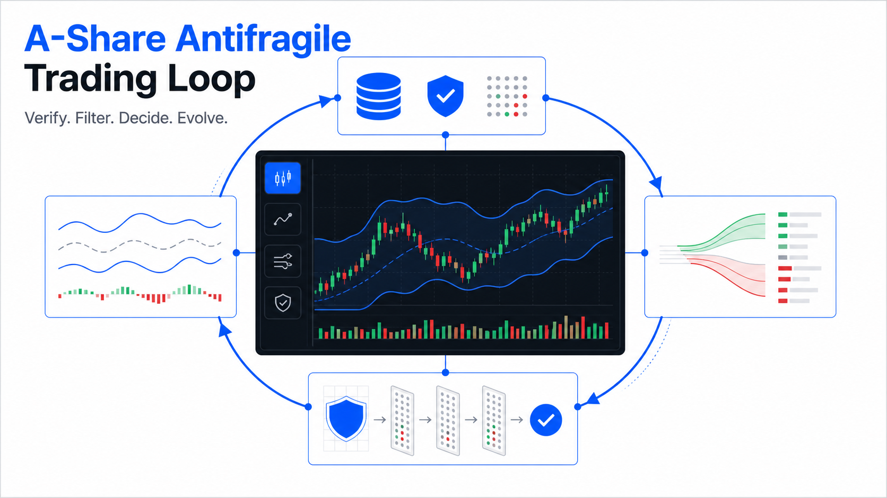

# A-Share Antifragile Trading Loop

### Una instantánea semanal de acciones A con privacidad desde el diseño

Verifique los datos, elimine narrativas sin respaldo y haga auditable la siguiente decisión.

[English](../README.md) | [Español](README.es.md) | [简体中文](README.zh-CN.md)

> [!IMPORTANT]
> Este proyecto sirve para educación e investigación cuantitativa. No envía órdenes ni ofrece asesoramiento financiero.

## Por qué existe

Una revisión semanal puede mezclar precios recientes, noticias antiguas y convicción personal. Este proyecto propone un ciclo más pequeño y seguro:

1. Obtener datos públicos durante la ejecución.
2. Mostrar la ventana temporal utilizada.
3. Marcar datos ausentes sin inventar precios.
4. Aplicar reglas de investigación antifrágil.
5. Generar una instantánea Markdown auditable.

## Capacidades

| Capacidad | Comportamiento |
|---|---|
| Contexto de acciones A | SSE Composite, SZSE Component y STAR 50 |
| Contexto internacional | SPY, QQQ y VIX |
| Lista configurable | Solo lee WATCH_TICKERS |
| Ventana semanal | Primera apertura y último cierre de la semana representada |
| Degradación explícita | No usa valores simulados |
| Salida portátil | Genera un informe Markdown local |

## Privacidad desde el diseño

- El repositorio no contiene una lista predeterminada de acciones.
- No solicita cantidades, costes de compra, cuentas ni correo electrónico.
- Git ignora configuraciones personales, informes, gráficos, registros y exportaciones.
- Los informes generados permanecen en el equipo local salvo publicación deliberada.

## Inicio rápido

~~~bash
git clone https://github.com/marqosjiang-gif/A-Share-Antifragile-Trading-Loop.git
cd A-Share-Antifragile-Trading-Loop

python3 -m venv .venv
source .venv/bin/activate
python3 run_weekly_report.py
~~~

Sin lista configurada, el informe solo contiene contexto de índices.

Para analizar sus propios símbolos:

~~~bash
export WATCH_TICKERS="<símbolo-de-seis-dígitos>.SS,<símbolo-de-seis-dígitos>.SZ"
python3 run_weekly_report.py
~~~

Shanghai usa .SS; Shenzhen usa .SZ.

## Archivo generado

~~~text
antifragile_weekly_YYYYMMDD.md
~~~

Incluye contexto de índices, referencia internacional, movimientos semanales opcionales, disponibilidad de datos y reglas antifrágiles.

## Funcionamiento

~~~mermaid
flowchart TD
    A["WATCH_TICKERS opcional"] --> B["Fuentes públicas en tiempo de ejecución"]
    B --> C["Validar símbolo y ventana"]
    C --> D{"¿Datos disponibles?"}
    D -- No --> E["Marcar no disponible"]
    D -- Sí --> F["Calcular primera apertura a último cierre"]
    E --> G["Instantánea Markdown"]
    F --> G
    G --> H["Revisar, filtrar y decidir"]
~~~

## Configuración

| Variable | Uso | Obligatoria |
|---|---|---|
| WATCH_TICKERS | Símbolos de acciones A separados por comas | No |
| TA_VENV | Ruta Python opcional de TradingAgents | No |
| TA_RUN_WEBUI_TOOLS | Adaptador opcional de TradingAgents | No |
| TA_CWD | Directorio opcional de TradingAgents | No |

El núcleo público usa únicamente la biblioteca estándar de Python.

## Verificación

~~~bash
python3 -m py_compile run_weekly_report.py
python3 -m unittest test_public_snapshot -v
~~~

## Extensión segura

Se pueden añadir BOLL, flujos de capital, verificación de eventos y registros de decisión. Los símbolos deben entrar por configuración y cada dato debe conservar fuente, fecha y estado de degradación.

## Licencia

Publicado bajo la [Licencia MIT](../LICENSE).

## Aviso legal

Los datos pueden retrasarse, faltar o no estar disponibles. El proyecto no garantiza precisión, resultados de trading ni rentabilidad futura. Cada usuario es responsable de su investigación y decisiones.
