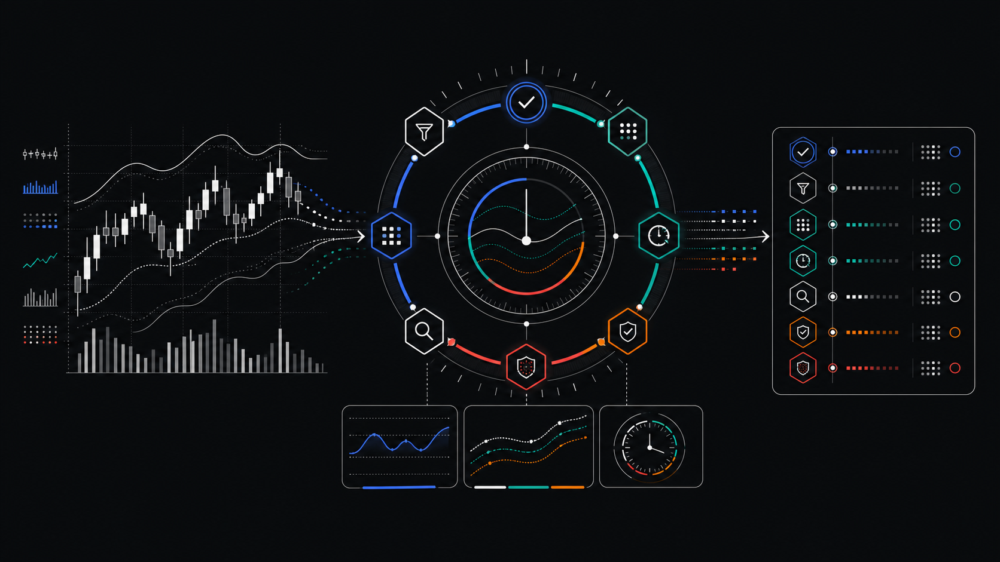
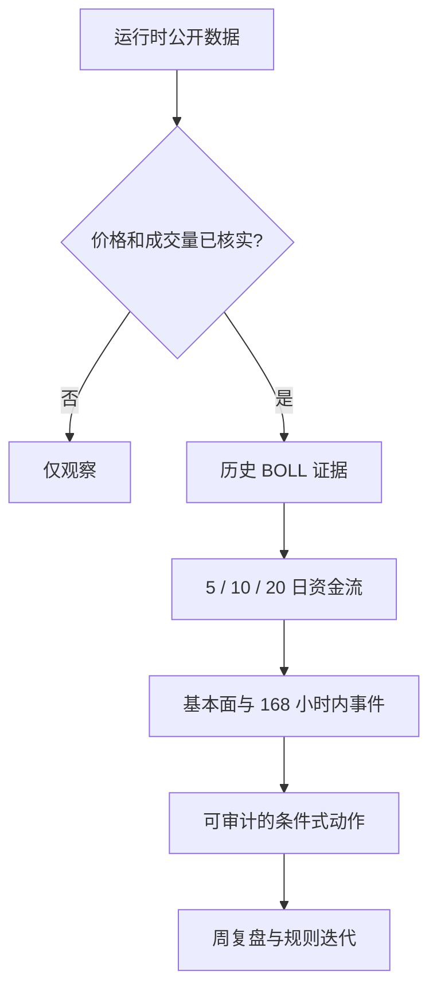

<div align="center">

# A-Share Antifragile Trading Loop

### 面向 A 股的隐私优先周度反脆弱研究闭环

核实数字，删除陈旧叙事，让可审计证据决定下一步。

[English](../README.md) | [Español](README.es.md) | [简体中文](README.zh-CN.md)

[](../LICENSE)
[](https://www.python.org/)
[](#项目能力)
[](#隐私设计)



</div>

> [!IMPORTANT]
> 本项目仅用于教育与研究，不自动下单，也不承诺投资收益。

## 为什么做这个项目

当周复盘把最新价格、陈旧事件、不同统计周期和主观判断混在一起时，结论很容易失真。本项目把流程收敛成一个可测试闭环：

1. 运行时读取公开数据。
2. 明确标注每个统计区间。
3. 价格或成交量未核实时停止方向性判断。
4. 以有足够历史样本的 BOLL 结果作为最高权重。
5. 资金流、基本面、商品和事件只做确认或风险约束。
6. 数据失败时明确降级，绝不用模拟行情补位。

## 项目能力

| 能力 | 公开版行为 |
|---|---|
| A 股市场环境 | 上证综指、深证成指、科创 50 快照 |
| 可配置股票列表 | 仅从 `WATCH_TICKERS` 读取，默认空列表 |
| 周涨跌口径 | 最近数据所覆盖交易周的首个开盘至最后收盘；周日自动化对应本周一至周五，节假日按实际交易日 |
| 资金流窗口 | 精确汇总 5/10/20 个交易日，并保留起止日期 |
| 决策仲裁 | 数据硬门槛后，BOLL > 量价 > 资金 > 基本面 > 宏观叙事 |
| 事件时效 | 超过复盘时点 168 小时的事件不得作为本周新增交易依据 |
| 黄金仓位 | 读取 CFTC COMEX 管理基金周度仓位，失败时明确提示 |
| 失效处理 | 标注数据不可用，不生成模拟值或伪结论 |

## 隐私设计

- 不提供默认股票、持仓、数量、成本、账户或邮箱。
- 报告、本地配置、日志、导出和图表默认被 Git 忽略。
- 股票代码只在运行时由用户提供，除非用户主动发布，否则留在本地。
- 公开决策模块只处理通用证据对象，不依赖任何个人画像。

## 快速开始

```bash
git clone https://github.com/marqosjiang-gif/A-Share-Antifragile-Trading-Loop.git
cd A-Share-Antifragile-Trading-Loop
python3 -m venv .venv
source .venv/bin/activate
python3 run_weekly_report.py
```

首次运行无需配置股票，只生成市场环境。添加自己的研究代码：

```bash
export WATCH_TICKERS="<六位股票代码>.SS,<六位股票代码>.SZ"
python3 run_weekly_report.py
```

上海使用 `.SS`，深圳使用 `.SZ`。如需关闭 CFTC 公开数据请求，设置 `ENABLE_CFTC_GOLD=0`。

## 输出内容

```text
antifragile_weekly_YYYYMMDD.md
```

报告包含市场环境、可选股票周表现、公开黄金仓位背景、数据降级状态和反脆弱研究护栏。

## 决策契约



BOLL 要成为可执行信号，必须数据已核实且历史完成交易不少于 3 笔。低优先级证据可以降低信心或收紧风险，但不能静默覆盖有效的高优先级信号。

## 项目结构

```text
.
├── antifragile/
│   ├── cftc.py          # CFTC 黄金周度仓位
│   ├── decision.py      # 证据优先级与动作仲裁
│   ├── flows.py         # 5/10/20 日资金窗口
│   └── freshness.py     # 168 小时事件门槛
├── assets/readme/
├── docs/
├── run_weekly_report.py
├── test_public_snapshot.py
├── config.yaml
└── DESIGN.md
```

## 验证

```bash
python3 -m py_compile run_weekly_report.py antifragile/*.py
python3 -m unittest test_public_snapshot -v
```

测试覆盖空股票列表、精确资金窗口、重复日期拦截、事件时效、BOLL 优先级、低样本保护、冲突证据和 CFTC 解析。

## 配置

| 变量 | 用途 | 默认值 |
|---|---|---|
| `WATCH_TICKERS` | 逗号分隔的 A 股代码 | 空 |
| `ENABLE_CFTC_GOLD` | 开启 CFTC 黄金仓位背景 | `1` |

公开核心只使用 Python 标准库。

## 参与贡献

欢迎提交 Issue 和 Pull Request。请勿提交密钥、个人金融数据、生成报告、私人路径或专有资料。

## 许可证

采用 [MIT License](../LICENSE)。

## 免责声明

市场数据可能延迟、缺失、修订或不可用。用户须自行核验信源并对自己的决策负责。
