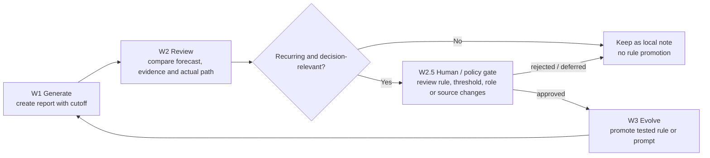

# Autonomous evolution loop

This project treats improvement as a controlled weekly loop, not as unrestricted self-modification.

## W1 → W2 → W2.5 → W3



## What changed in the latest iteration

- **Strategy-horizon signal selection:** a notification uses the declared strategy horizon, not whichever technical distance happens to be nearest.
- **Visible failure states:** missing, stale or failed sources remain visible and block unsupported directional conclusions.
- **Bounded prompt editing:** prompts are edited by a scored, limited add/replace/delete process with a before/after review.
- **Render-level checks:** output structure and forbidden wording are checked after generation, so formatting drift cannot silently change meaning.

## Promotion rules

1. Use only information that was available by the original report's `evidence_cutoff` when judging the report.
2. Classify the difference as `judgment_error`, `information_omission`, `post_report_event`, or `data_or_execution_error`.
3. Promote only a recurring, decision-relevant rule that improves auditability or execution safety.
4. Keep one-off market opinions, private portfolio details and generated reports local.
5. Route changes to signal priority, thresholds, agent roles, prompts, data sources or fallback chains through the W2.5 human/policy gate.
6. Allow automatic promotion only for wording, formatting and non-decision-affecting presentation fixes, with a record.

## What “autonomous” means here

The loop can detect repeated failure modes, propose a rule change, update a local experiment, and run tests. It cannot place orders, change a brokerage account, or silently publish private data. Autonomy is bounded by evidence, reproducibility, reversible promotion and a human/policy checkpoint for decision-affecting changes.

## Minimal review record

```yaml
report_id: weekly-YYYYMMDD
evidence_cutoff: YYYY-MM-DDTHH:MM:SS+TZ
classification: data_or_execution_error
observed_gap: "source timestamp was missing"
proposed_rule: "block directional output when timestamp is absent"
status: proposed
```
