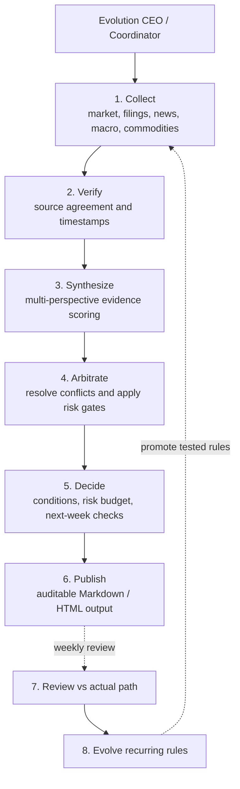

# Expert Council: evidence-to-decision collaboration

The public project separates reusable decision rules from private portfolio data. Its expert council is a staged collaboration pattern: each role receives the output of the previous stage, and the coordinator prevents unsupported shortcuts.

## The six-stage weekly council

| Stage | Public responsibility | Output contract |
|---|---|---|
| Collect | Gather price, volume, announcements, macro and commodity observations | Dated raw observations with source labels |
| Verify | Reject stale, single-source or conflicting claims | Evidence table with confidence and missing-data flags |
| Synthesize | Compare independent perspectives and score alternatives | Explicit assumptions, counter-evidence and scenario set |
| Arbitrate | Apply the signal hierarchy and hard survival gates | Conflict resolution record; no silent override |
| Decide | Convert evidence into conditions, not unconditional predictions | Next-week checks, risk budget and stop conditions |
| Publish | Render a readable, reproducible report | Markdown/HTML report with cutoff and provenance |

## Why the council is useful

- It makes disagreement visible instead of hiding it inside one model output.
- It separates fact collection from interpretation and interpretation from action.
- It lets the coordinator downgrade a conclusion when a required source or gate is missing.
- It keeps the public interface portfolio-neutral: examples use placeholders, not real positions.

## Privacy boundary

The council can consume a user's private local adapter, but this repository does not define or store a portfolio, account, quantity, cost basis, email, token, API key, cached quote, or machine-specific path. See [`PUBLIC_PROTOCOL.md`](../PUBLIC_PROTOCOL.md).
